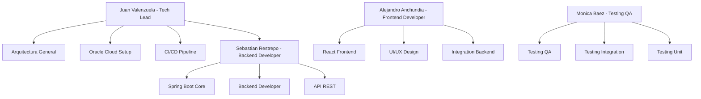

# 🚀 E-Learning Platform v2.0 - Academia Digital para Desarrolladores

<div align="center">


[](https://github.com/Juan-Valenzuela3/E-Learning-Platform/tree/develop)
[](https://trello.com/b/v7VAKuAp/hackathon-one)
[](https://68d1ca8ed053bef8d836fb49--e-learning-platform-v2.netlify.app)
[](#)

### **🏆 Proyecto desarrollado para el Hackathon NoCountry - Oracle Next Education (ONE)**

*Una plataforma innovadora que democratiza el acceso a la educación tecnológica de calidad, conectando instructores expertos con desarrolladores en crecimiento*

## 🆕 **Versión 2.0 - Nuevas Funcionalidades**

**Esta es la versión 2.0 del E-Learning Platform**, que incluye mejoras significativas y nuevas funcionalidades que posteriormente se integrarán con la versión 1.0 original:

### ✨ **Nuevas Características v2.0**
- 🎨 **Diseño Responsivo Completo**: Interfaz adaptada para móviles, tablets y desktop
- 🔧 **Mejoras en UX/UI**: Componentes más modernos y experiencia de usuario optimizada
- 🚀 **Optimizaciones de Performance**: Carga más rápida y mejor manejo de errores
- 🛡️ **CORS Mejorado**: Configuración robusta para despliegues en Netlify y Render
- 📱 **Mobile-First Design**: Prioridad en experiencia móvil con diseño responsive
- ⚡ **Mejor Manejo de Errores**: Interceptores mejorados y retry automático
- 🎯 **Componentes Reutilizables**: Arquitectura más modular y mantenible

### 🔄 **Roadmap de Integración**
- **Fase 1**: ✅ v2.0 desplegada y funcionando independientemente
- **Fase 2**: 🔄 Integración con v1.0 y merge de funcionalidades
- **Fase 3**: 🚀 Lanzamiento de la versión unificada final

</div>

---

## 📊 **Comparación v1.0 vs v2.0**

| Característica | v1.0 Original | v2.0 Mejorada |
|----------------|---------------|---------------|
| **Responsive Design** | Básico | ✅ Completo (Mobile-First) |
| **CORS Configuration** | Local | ✅ Netlify + Render |
| **Error Handling** | Estándar | ✅ Interceptores + Retry |
| **Performance** | Base | ✅ Optimizada |
| **UI Components** | Material-UI | ✅ Tailwind + Custom |
| **Deployment** | Oracle Cloud | ✅ Netlify + Render |
| **Mobile Experience** | Limitada | ✅ Prioritaria |
| **Code Architecture** | Monolítica | ✅ Modular |

### 🎯 **Objetivo de v2.0**
La versión 2.0 fue desarrollada para:
- Probar nuevas tecnologías y enfoques
- Mejorar la experiencia móvil
- Optimizar el rendimiento
- Facilitar el mantenimiento
- Preparar la integración final con v1.0

---

## 📖 **Descripción del Proyecto**

**E-Learning Platform** es una academia digital integral diseñada específicamente para desarrolladores y profesionales TI que buscan expandir sus habilidades técnicas. La plataforma facilita la creación, gestión y comercialización de cursos especializados, integrando un ecosistema completo de aprendizaje con pagos seguros, recursos multimedia y una experiencia de usuario excepcional.

### 👥 **Público Objetivo**

- **Desarrolladores Junior**: Buscan ampliar sus conocimientos y especializarse en nuevas tecnologías
- **Profesionales Senior**: Comparten su experiencia creando cursos y generando ingresos pasivos
- **Estudiantes de Tecnología**: Complementan su formación académica con contenido práctico
- **Empresas**: Capacitan a sus equipos con cursos especializados y actualizados
- **Freelancers**: Adquieren nuevas habilidades para expandir sus servicios

---

## ✨ **Funcionalidades Principales del MVP**

### 🔐 **Sistema de Autenticación Integral**
- Registro diferenciado por roles (Estudiante, Instructor, Administrador)
- Autenticación JWT con renovación automática de tokens
- Perfiles completos con información profesional y académica
- Gestión de sesiones seguras con control de dispositivos

### 📚 **Gestión Avanzada de Cursos**
- **Creación de Contenido**: Editor intuitivo para instructores con soporte multimedia
- **Organización Modular**: Estructuración en secciones, lecciones y recursos descargables
- **Categorización Inteligente**: Sistema de tags y categorías para fácil búsqueda
- **Control de Versiones**: Actualización de contenido sin afectar estudiantes activos
- **Análisis de Engagement**: Métricas detalladas de progreso y interacción

### 💳 **Sistema de Pagos Robusto**
- **Integración Stripe**: Pagos seguros con tarjetas de crédito/débito
- **Modelos de Precios**: Cursos individuales

### 🏆 **Progreso y Certificaciones**
- **Tracking Detallado**: Seguimiento granular del progreso del estudiante
- **Gamificación**: Sistema de badges y logros por completar objetivos

### 🔍 **Búsqueda y Recomendaciones**
- **Motor de Búsqueda**: Filtros avanzados por tecnología, nivel y precio
- **Wishlist**: Lista de cursos deseados con notificaciones de descuentos

---

## 🏗️ **Arquitectura Tecnológica**

### **Arquitectura General**
```
┌─────────────────┐    ┌──────────────────┐    ┌─────────────────┐
│   Frontend      │    │    Backend       │    │   Cloud Storage │
│   React 18      │◄──►│  Spring Boot 3.5 │◄──►│  Oracle Object  │
│   Vercel        │    │  Oracle Cloud    │    │    Storage      │
└─────────────────┘    └──────────────────┘    └─────────────────┘
         │                        │                        │
         └────────────────────────┼────────────────────────┘
                                  ▼
                    ┌──────────────────┐
                    │   MySQL Database │
                    │  Oracle Cloud    │
                    └──────────────────┘
```

### **Stack Tecnológico Backend**

| Categoría | Tecnología | Versión | Propósito |
|-----------|------------|---------|-----------|
| **Core Framework** | Spring Boot | 3.5.5 | Framework principal de aplicación |
| **Lenguaje** | Java | 21 LTS | Lenguaje de desarrollo principal |
| **Base de Datos** | MySQL | 8.0+ | Almacenamiento principal de datos |
| **ORM** | Spring Data JPA | - | Mapeo objeto-relacional |
| **Seguridad** | Spring Security + JWT | - | Autenticación y autorización |
| **Pagos** | Stripe Java SDK | - | Procesamiento de pagos |
| **Cloud Storage** | Oracle Cloud SDK | - | Almacenamiento de recursos multimedia |
| **Documentación** | SpringDoc OpenAPI | - | Documentación automática de API |
| **Testing** | JUnit 5 + Testcontainers | - | Testing integral automatizado |
| **Build** | Maven | 3.8+ | Gestión de dependencias y build |

### **Stack Tecnológico Frontend**

| Categoría | Tecnología | Versión | Propósito |
|-----------|------------|---------|-----------|
| **Framework** | React | 18 | Biblioteca principal UI |
| **Build Tool** | Vite | Latest | Build tool y dev server |
| **UI Framework** | Material-UI | v5 | Componentes de interfaz |
| **Styling** | TailwindCSS | v3 | Framework CSS utility-first |
| **Routing** | React Router | v7 | Enrutamiento SPA |
| **State Management** | TanStack Query | v4 | Gestión de estado servidor |
| **Forms** | React Hook Form + Yup | - | Manejo de formularios y validación |
| **HTTP Client** | Axios | - | Cliente HTTP para API calls |
| **Charts** | Chart.js + Recharts | - | Visualización de datos |
| **Icons** | Lucide React | - | Biblioteca de iconos |

---

## ☁️ **Arquitectura de Despliegue v2.0**

### **Frontend - Netlify**
- **URL**: https://68d1ca8ed053bef8d836fb49--e-learning-platform-v2.netlify.app
- **Plataforma**: Netlify (CDN Global)
- **Build**: Automático desde GitHub
- **Features**: Deploy instantáneo, SSL automático, optimización de assets

### **Backend - Render**
- **URL**: https://e-learning-platform-2-dew2.onrender.com
- **Plataforma**: Render (Cloud Platform)
- **Database**: PostgreSQL (Render managed)
- **Features**: Auto-deploy, health checks, logging integrado

### **Arquitectura de Despliegue en Oracle Cloud (v1.0)**

### **Infraestructura como Código**

```yaml
Compartimiento: E-Learning-Production
├── Networking:
│   ├── VCN (Virtual Cloud Network)
│   ├── Internet Gateway
│   ├── NAT Gateway
│   ├── Security Lists
│   └── Network Security Groups
├── Compute:
│   ├── VM Oracle Linux 8 (Shape: VM.Standard.E4.Flex)
│   ├── Load Balancer (Certificate Manager SSL)
│   └── Auto-scaling Configuration
├── Database:
│   ├── MySQL Database Service (High Availability)
│   ├── Backup Policy (Daily + Weekly)
│   └── Read Replicas for Performance
├── Storage:
│   ├── Object Storage (Videos + Recursos)
│   ├── Block Storage (Logs + Backups)
│   └── Content Delivery Network
└── Security:
    ├── Identity & Access Management (IAM)
    ├── Web Application Firewall (WAF)
    └── Vault (Secret Management)
```

### **Pipeline CI/CD con GitHub Actions**

```yaml
Workflows:
├── Development Branch:
│   ├── Unit Tests + Integration Tests
│   ├── Code Quality Analysis (SonarQube)
│   ├── Security Scanning (OWASP Dependency Check)
│   └── Deploy to Dev Environment
└── Main Branch:
    ├── All Previous Checks
    ├── Performance Tests (JMeter)
    ├── Build Docker Images
    ├── Deploy to Oracle Cloud
    └── Health Check Monitoring
```

---

## 🗃️ **Modelo de Base de Datos Optimizado**

### **Entidades Principales**

#### 👤 **Users** (users)
```sql
CREATE TABLE users (
    id BIGINT AUTO_INCREMENT PRIMARY KEY,
    email VARCHAR(255) UNIQUE NOT NULL,
    password_hash VARCHAR(255) NOT NULL,
    first_name VARCHAR(100) NOT NULL,
    last_name VARCHAR(100) NOT NULL,
    role ENUM('STUDENT', 'INSTRUCTOR', 'ADMIN') DEFAULT 'STUDENT',
    is_active BOOLEAN DEFAULT TRUE,
    email_verified BOOLEAN DEFAULT FALSE,
    profile_image_url TEXT,
    bio TEXT,
    linkedin_url VARCHAR(500),
    github_url VARCHAR(500),
    website_url VARCHAR(500),
    created_at TIMESTAMP DEFAULT CURRENT_TIMESTAMP,
    updated_at TIMESTAMP DEFAULT CURRENT_TIMESTAMP ON UPDATE CURRENT_TIMESTAMP,
    INDEX idx_email (email),
    INDEX idx_role (role),
    INDEX idx_active (is_active)
);
```

#### 📚 **Courses** (courses)
```sql
CREATE TABLE courses (
    id BIGINT AUTO_INCREMENT PRIMARY KEY,
    instructor_id BIGINT NOT NULL,
    title VARCHAR(255) NOT NULL,
    slug VARCHAR(255) UNIQUE NOT NULL,
    short_description TEXT,
    long_description LONGTEXT,
    thumbnail_url TEXT,
    trailer_video_url TEXT,
    price DECIMAL(10,2) DEFAULT 0.00,
    discounted_price DECIMAL(10,2),
    level ENUM('BEGINNER', 'INTERMEDIATE', 'ADVANCED') DEFAULT 'BEGINNER',
    duration_hours INT DEFAULT 0,
    language VARCHAR(10) DEFAULT 'es',
    status ENUM('DRAFT', 'PUBLISHED', 'ARCHIVED') DEFAULT 'DRAFT',
    is_featured BOOLEAN DEFAULT FALSE,
    total_enrollments INT DEFAULT 0,
    average_rating DECIMAL(3,2) DEFAULT 0.00,
    total_reviews INT DEFAULT 0,
    last_updated TIMESTAMP DEFAULT CURRENT_TIMESTAMP,
    created_at TIMESTAMP DEFAULT CURRENT_TIMESTAMP,
    updated_at TIMESTAMP DEFAULT CURRENT_TIMESTAMP ON UPDATE CURRENT_TIMESTAMP,
    FOREIGN KEY (instructor_id) REFERENCES users(id),
    INDEX idx_instructor (instructor_id),
    INDEX idx_status (status),
    INDEX idx_level (level),
    INDEX idx_featured (is_featured),
    FULLTEXT(title, short_description)
);
```

#### 📹 **Course Videos** (course_videos)
```sql
CREATE TABLE course_videos (
    id BIGINT AUTO_INCREMENT PRIMARY KEY,
    course_id BIGINT NOT NULL,
    title VARCHAR(255) NOT NULL,
    description TEXT,
    video_url TEXT NOT NULL,
    duration_seconds INT DEFAULT 0,
    order_index INT NOT NULL,
    is_preview BOOLEAN DEFAULT FALSE,
    transcript LONGTEXT,
    created_at TIMESTAMP DEFAULT CURRENT_TIMESTAMP,
    updated_at TIMESTAMP DEFAULT CURRENT_TIMESTAMP ON UPDATE CURRENT_TIMESTAMP,
    FOREIGN KEY (course_id) REFERENCES courses(id) ON DELETE CASCADE,
    INDEX idx_course_order (course_id, order_index),
    INDEX idx_preview (is_preview)
);
```

#### 🎓 **Enrollments** (enrollments)
```sql
CREATE TABLE enrollments (
    id BIGINT AUTO_INCREMENT PRIMARY KEY,
    user_id BIGINT NOT NULL,
    course_id BIGINT NOT NULL,
    enrolled_at TIMESTAMP DEFAULT CURRENT_TIMESTAMP,
    progress_percentage DECIMAL(5,2) DEFAULT 0.00,
    completed_at TIMESTAMP NULL,
    certificate_issued BOOLEAN DEFAULT FALSE,
    certificate_url TEXT,
    last_accessed TIMESTAMP DEFAULT CURRENT_TIMESTAMP,
    FOREIGN KEY (user_id) REFERENCES users(id),
    FOREIGN KEY (course_id) REFERENCES courses(id),
    UNIQUE KEY unique_enrollment (user_id, course_id),
    INDEX idx_user (user_id),
    INDEX idx_course (course_id),
    INDEX idx_progress (progress_percentage)
);
```

### **Relaciones y Restricciones**

- **Users ↔ Courses**: 1:N (Un instructor puede crear múltiples cursos)
- **Courses ↔ Videos**: 1:N (Un curso tiene múltiples videos)
- **Users ↔ Enrollments**: 1:N (Un usuario puede inscribirse a múltiples cursos)
- **Courses ↔ Enrollments**: 1:N (Un curso puede tener múltiples estudiantes)
- **Pagos ↔ Enrollments**: 1:1 (Cada inscripción tiene un pago asociado)

---

## 🔧 **Requisitos del Sistema**

### **Requisitos Funcionales**

| ID | Descripción | Prioridad | Estado |
|----|-------------|-----------|---------|
| **RF01** | Sistema de registro y autenticación multirol | 🔴 Crítico | ✅ Completado |
| **RF02** | Gestión completa de perfiles de usuario | 🔴 Crítico | ✅ Completado |
| **RF03** | CRUD completo de cursos con multimedia | 🔴 Crítico | ✅ Completado |
| **RF04** | Sistema de categorías y subcategorías | 🔴 Crítico | ✅ Completado |
| **RF05** | Reproductor de video con controles avanzados | 🟡 Importante | ✅ Completado |
| **RF06** | Integración completa de pagos con Stripe | 🔴 Crítico | ✅ Completado |
| **RF07** | Sistema de inscripciones y progreso | 🔴 Crítico | ✅ Completado |
| **RF08** | Dashboard de administración | 🟡 Importante | ✅ Completado |
| **RF09** | Sistema de búsqueda y filtros | 🟡 Importante | ✅ Completado |
| **RF10** | Generación de certificados digitales | 🟢 Opcional | 🚧 En desarrollo |

### **Requisitos No Funcionales**

| ID | Categoría | Descripción | Métricas de Aceptación |
|----|-----------|-------------|----------------------|
| **RNF01** | **Rendimiento** | Tiempo de respuesta API | < 200ms para consultas simples |
| **RNF02** | **Rendimiento** | Streaming de video sin interrupciones | Buffer < 3 segundos |
| **RNF03** | **Seguridad** | Autenticación JWT con rotación | Tokens válidos por 24h |
| **RNF04** | **Seguridad** | Encriptación end-to-end | AES-256 para datos sensibles |
| **RNF05** | **Seguridad** | Protección contra ataques comunes | OWASP Top 10 compliance |
| **RNF06** | **Escalabilidad** | Soporte concurrente de usuarios | 1000+ usuarios simultáneos |
| **RNF07** | **Escalabilidad** | Auto-scaling en Oracle Cloud | Scale hasta 10 instancias |
| **RNF08** | **Disponibilidad** | Uptime del servicio | 99.9% disponibilidad |
| **RNF09** | **Disponibilidad** | Recuperación ante fallos | RTO < 4 horas, RPO < 1 hora |
| **RNF10** | **Usabilidad** | Interfaz responsive | Soporte móvil completo |
| **RNF11** | **Compatibilidad** | Navegadores soportados | Chrome, Firefox, Safari, Edge |
| **RNF12** | **Mantenibilidad** | Documentación API completa | Swagger UI actualizado |

### **Restricciones Técnicas y de Negocio**

- **Lenguaje**: Java 21 LTS para garantizar soporte a largo plazo
- **Base de Datos**: MySQL 8.0+ con replicación para alta disponibilidad
- **Cloud Provider**: Oracle Cloud Infrastructure (requisito del hackathon)
- **Compliance**: LGPD/GDPR para protección de datos personales
- **Pagos**: Integración exclusiva con Stripe (certificación PCI DSS)

---

## 🚀 **Instalación y Configuración**

### **Prerrequisitos del Entorno**

- **Java Development Kit**: OpenJDK 21 LTS
- **Build Tool**: Apache Maven 3.8+
- **Base de Datos**: MySQL 8.0+ o MariaDB 10.6+
- **Node.js**: v18+ para el frontend
- **Package Manager**: npm/yarn/pnpm
- **Git**: Para control de versiones
- **Docker**: (Opcional) Para contenedorización

### **Configuración del Backend**

1. **Clonar y configurar el repositorio**
```bash
git clone https://github.com/Juan-Valenzuela3/E-Learning-Platform.git
cd E-Learning-Platform/Backend/Dev-learning-Platform
```

2. **Configurar variables de entorno**
```bash
# Crear archivo .env en la raíz del proyecto backend
cp .env.example .env

# Configurar variables críticas
DB_URL=jdbc:mysql://localhost:3306/elearning_db
DB_USERNAME=your_db_username
DB_PASSWORD=your_secure_password
JWT_SECRET=your_super_secret_jwt_key_256_bits_minimum
STRIPE_SECRET_KEY=sk_test_your_stripe_secret_key
STRIPE_PUBLISHABLE_KEY=pk_test_your_stripe_publishable_key
OCI_CONFIG_FILE=/path/to/oci/config
OCI_CONFIG_PROFILE=DEFAULT
```

3. **Configurar base de datos**
```sql
-- Crear base de datos
CREATE DATABASE elearning_db CHARACTER SET utf8mb4 COLLATE utf8mb4_unicode_ci;

-- Crear usuario específico (opcional pero recomendado)
CREATE USER 'elearning_user'@'localhost' IDENTIFIED BY 'secure_password';
GRANT ALL PRIVILEGES ON elearning_db.* TO 'elearning_user'@'localhost';
FLUSH PRIVILEGES;
```

4. **Compilar y ejecutar**
```bash
# Instalar dependencias y compilar
mvn clean install -DskipTests

# Ejecutar con perfil de desarrollo
mvn spring-boot:run -Dspring.profiles.active=dev

# Verificar que el servidor esté corriendo
curl http://localhost:8080/actuator/health
```

### **Configuración del Frontend**

1. **Navegar al directorio frontend**
```bash
cd ../../Frontend
```

2. **Instalar dependencias**
```bash
# Usando npm
npm install

# O usando pnpm (recomendado por velocidad)
pnpm install
```

3. **Configurar variables de entorno**
```bash
# Crear archivo .env.local
echo "REACT_APP_API_BASE_URL=http://localhost:8080/api" > .env.local
echo "REACT_APP_STRIPE_PUBLISHABLE_KEY=pk_test_your_stripe_key" >> .env.local
```

4. **Ejecutar en modo desarrollo**
```bash
npm run dev
# o
pnpm dev

# La aplicación estará disponible en http://localhost:3000
```

### **Verificación de la Instalación**

```bash
# Backend Health Check
curl http://localhost:8080/actuator/health

# Frontend availability
curl http://localhost:3000

# API endpoints test
curl http://localhost:8080/api/categories
```

---

## 🧪 **Testing y Calidad de Código**

### **Estrategia de Testing**

```bash
# Ejecutar todos los tests
mvn clean test

# Tests de integración con Testcontainers
mvn test -Dtest=*IntegrationTest

# Coverage report
mvn jacoco:report

# Tests de rendimiento
mvn test -Dtest=*PerformanceTest
```

### **Tipos de Testing Implementados**

| Tipo | Cobertura | Herramientas | Objetivo |
|------|-----------|--------------|----------|
| **Unit Tests** | 85%+ | JUnit 5, Mockito | Lógica de negocio |
| **Integration Tests** | 70%+ | Testcontainers, WireMock | APIs y BD |
| **Security Tests** | Auth & Authorization | Spring Security Test | Seguridad |

### **Scripts de Validación**

```bash
# Script de health check del backend
./Backend/check-backend.sh

# Validación de CORS
./Backend/test-cors.sh

# Tests de endpoints críticos
./Backend/test-critical-endpoints.sh
```

---
## 👥 **Equipo de Desarrollo - Team 7**

<div align="center">

### 🏆 **Hackathon NoCountry - Oracle Next Education (ONE)**

*Desarrollado con 💚 por estudiantes de AluraLatam*

| Desarrollador | GitHub | LinkedIn | Rol y Especialización |
|---------------|--------|----------|---------------------|
| **Juan Valenzuela** | [@Juan-Valenzuela3](https://github.com/Juan-Valenzuela3) | [LinkedIn](https://www.linkedin.com/in/juan-valenzuela-camelo) | *🚀 Tech Lead & DevOps Engineer*<br/>Backend Architecture, Oracle Cloud, CI/CD |
| **Sebastian Restrepo** | [@srestre84](https://github.com/srestre84) | [LinkedIn](#) | *⚡ Backend Developer*<br/>Spring Boot, API Design, Database Architecture |
| **Alejandro Anchundia** | [@EV3THlm](https://github.com/anchundiatech) | [LinkedIn](#) | *🎨 Frontend Developer*<br/>React Development, UI/UX, Frontend Architecture |
| **Monica Baez** | [@MONKORPSE](https://github.com/MONKORPSE) | [LinkedIn](#) | *🔒 Testing Developer & QA*<br/>JUnit, Testing |

</div>

### **🎯 Metodología de Desarrollo**

#### **Scrum Framework**
- **Sprints**: 4 semanas de duración
- **Daily Standups**: Sincronización diaria del equipo
- **Sprint Planning**: Definición de objetivos y tareas
- **Retrospectives**: Mejora continua del proceso
- **Product Backlog**: Gestión en [Trello Board](https://trello.com/b/v7VAKuAp/hackathon-one)

#### **Herramientas de Colaboración**
- **Comunicación**: Plataforma NoCountry + Google Meet
- **Gestión de Tareas**: Trello con metodología Kanban
- **Code Review**: GitHub Pull Requests con revisión obligatoria
- **Documentación**: GitHub Wiki + README técnico
- **Testing**: Pair Programming en funcionalidades críticas


---
## 🌟 **Reconocimientos y Aprendizajes**

### **🏆 Logros del Hackathon**
- ✅ **MVP Completamente Funcional**: Todas las features críticas implementadas
- ✅ **Arquitectura Enterprise**: Diseño escalable y mantenible
- ✅ **Deploy en Producción**: Aplicación live en Oracle Cloud
- ✅ **Documentación Completa**: README, API docs y guías de instalación
- ✅ **Testing Coverage**: +80% de cobertura en componentes críticos
- ✅ **Security Best Practices**: JWT, CORS, encriptación, validaciones

### **📚 Tecnologías Aprendidas**
- **Oracle Cloud Infrastructure**: Networking, Compute, Database Services
- **Advanced Spring Boot**: Security, JPA, Actuator, Testing
- **Payment Integration**: Stripe webhooks y session management
- **React Ecosystem**: Vite, TanStack Query, React Hook Form
- **DevOps Practices**: GitHub Actions, Docker, automated deployments

### **🚀 Impacto y Escalabilidad**
El proyecto demostró la capacidad del equipo para:
- Entregar un producto complejo en tiempo limitado
- Implementar arquitecturas enterprise con tecnologías modernas
- Trabajar colaborativamente usando metodologías ágiles
- Crear código limpio, documentado y mantenible
- Integrar múltiples servicios externos de forma segura

---

## 📄 **Licencia y Términos de Uso**

### **MIT License**

```
MIT License

Copyright (c) 2024 Team 7 - NoCountry Hackathon
Oracle Next Education (ONE) - AluraLatam

Permission is hereby granted, free of charge, to any person obtaining a copy
of this software and associated documentation files (the "Software"), to deal
in the Software without restriction, including without limitation the rights
to use, copy, modify, merge, publish, distribute, sublicense, and/or sell
copies of the Software, and to permit persons to whom the Software is
furnished to do so, subject to the following conditions:

The above copyright notice and this permission notice shall be included in all
copies or substantial portions of the Software.

THE SOFTWARE IS PROVIDED "AS IS", WITHOUT WARRANTY OF ANY KIND, EXPRESS OR
IMPLIED, INCLUDING BUT NOT LIMITED TO THE WARRANTIES OF MERCHANTABILITY,
FITNESS FOR A PARTICULAR PURPOSE AND NONINFRINGEMENT. IN NO EVENT SHALL THE
AUTHORS OR COPYRIGHT HOLDERS BE LIABLE FOR ANY CLAIM, DAMAGES OR OTHER
LIABILITY, WHETHER IN AN ACTION OF CONTRACT, TORT OR OTHERWISE, ARISING FROM,
OUT OF OR IN CONNECTION WITH THE SOFTWARE OR THE USE OR OTHER DEALINGS IN THE
SOFTWARE.
```

### **Términos de Uso Educativo**
Este proyecto fue desarrollado con fines educativos en el contexto del hackathon de **NoCountry** y **AluraLatam**. Se permite el uso libre del código para:

- ✅ Aprendizaje y práctica de desarrollo
- ✅ Contribuciones open source

### **Reconocimientos**
- **Oracle**: Por proporcionar la infraestructura cloud y formación
- **AluraLatam**: Por el programa educativo Oracle Next Education
- **NoCountry**: Por organizar el hackathon y proporcionar el entorno de aprendizaje
- **Stripe**: Por facilitar la integración de pagos
- **Comunidad Open Source**: Por las librerías y frameworks utilizados

---
